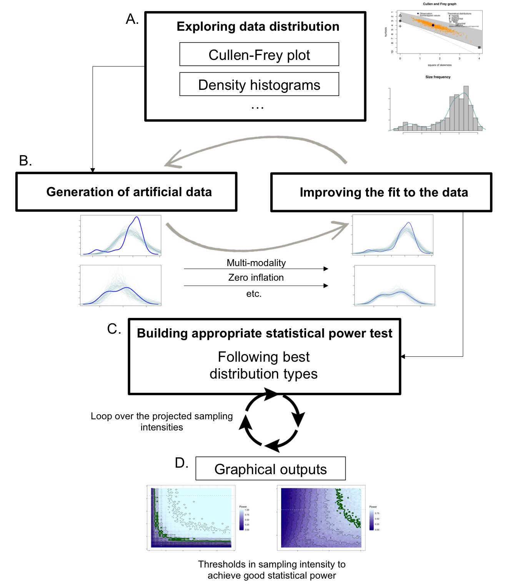

# Custom Statistical Power Analyses:
Ecological field data rarely follow standard distribution types. Adjustments should thus be made on the type of data distribution to be used when running statistical power analyses (e.g. to determine the appropriate sampling effort for monitoring programs). 

This repository regroups a number of functions that run statistical power analyses for a number of data distribution types. The choice of the most adequate distribution type may typically be decided from the results of preliminary surveys (or pilot studies). 

## Distribution types:
So far, the functions provided in this repository cover the following distribution types:
* Negative Binomial Distribution
* Zero-Inflated Negative Binomial Distribution
* Beta Distribution
* Bi-modal distribution types

All the functions are based on the ones implemented in the [emon package](https://cran.r-project.org/package=emon "emon package"). Following the same principles, they may be further adapted to any other distribution types, to fit the particular needs of each study.

## Provided functions:
Three functions are currently in the repository:
1. `power.groups.NB` for Negative Binomial and Zero-Inflated Negative Binomial distributions
2. `power.groups.beta` for beta distributions
3. `power.groups.bimode` for composite distribution types, drawn from either of the two previous categories.

These functions essentially loop over either permutation tests or Kruskal-Wallis rank sum tests, and return the statistical power - by simulation - for comparing two groups of independent observations (with the aforementioned tests). The functions can be run with the achieved sample size of a field campaign (to determine the achieved statistical power of the results of the study) or over a range of possible sample sizes, to determine for which sample size a satisfactory statistical power is obtained (0.8 and above are usually regarded satisfactory).

## General workflow:

## Basic examples:
### Determining the most appropriate data distribution type:
There exists a number of tools to explore the distribution types of experimental/observational data. Among them are Cullen-Frey plots (as in the [fitdistrplus package](https://cran.r-project.org/package=fitdistrplus "fitdistrplus package")), and density curves/histograms. These are useful to provide guidance and discover irregularities (typically: multi-modality, or potential zero-inflation), but precedence should be given to the properties of the selected distribution types (e.g. continuous *versus* discrete, interval of application, etc.).\
Zero-inflation corresponds to the disproportionate occurrence of zero in the data, *compared with* what randomly generated data with the chosen distribution would normally produce (Negative Binomial distribution does produce 0s, but maybe not enough to fit the observational data). It should thus be checked for separately.

### Extracting parameters for the generation of artificial data:
Negative binomial distributions require the specification of the mean (*mu*) and the size parameter (often referred to as *theta*) of each group. Beta distributions depends on two shape parameters (*shape1* and *shape2*), again, for each group. All these parameters may be directly estimated from experimental/observational data by fitting on them a model with the corresponding distribution type.\
This can be done by the `ebeta` function ([EnvStats package](https://cran.r-project.org/package=EnvStats "EnvStats package")), for the case of beta distributions, and by the `vglm` function of the [VGAM package](https://cran.r-project.org/package=VGAM "VGAM package"), for Negative Binomial distributions.\
The proportion of 0s in the data needs to be specified for zero-inflation scenarios, and the different modes of the data need to be separated and receive their own set of parameters.\
*More details on this process will be uploaded separately on the repository*

### Graphical outputs:
*With the use of the Count_dat.rds provided in the repository*\
This artificially generated data contains two groups (named "1" and "2"), respectively containing 50 and 35 observations. Here is what the data look like, and the results of the associated Kruskal-Wallis test. The test is significant. The statistical power of the test will then tell us how likely it would be to find similar results if another set of observations were made. 

For this example, the statistical power analyses was done using Negative Binomial distribution. A contour plot was generated to explore the evolution of the power value over different sample sizes on both sides of the realized sampling size (50, for the first group; 35, for the second). This helps deciding whether satisfactory sample size had been achieved, and at what threshold this satisfactory sample size was reached.

In this case, although the difference between the two groups was significant, the power of the test remains bellow the 0.8 threshold (in green). From this it should be concluded that, for instance, monitoring efforts would have more chance of capturing the correct structure of their data with slightly increased sample sizes (e.g. by bringing the sample size of the second group closer to 50).

